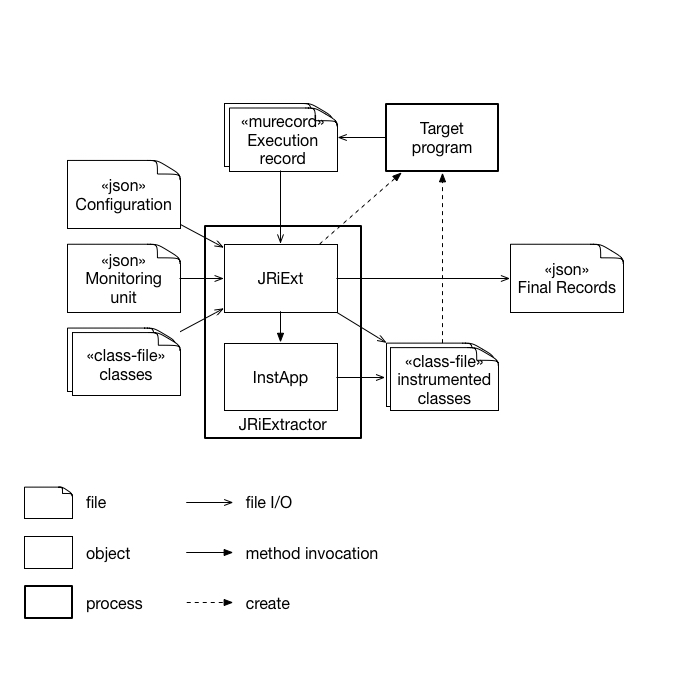
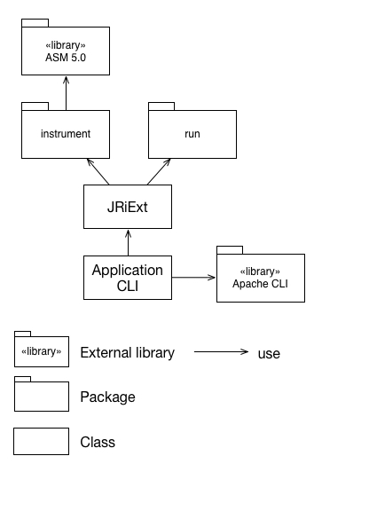

__GitHub Repository__: [byron1st/jriext](https://github.com/byron1st/jriext)

Java Runtime information Extractor

## Overview

자바 프로그램을 실제로 실행시켜 원하는 실행 데이터를 추출하는 프로그램으로, 여기서 실행 데이터라고 함은 다음과 같다.

*   메소드가 실행된 스레드
*   메소드가 실행된 시간
*   실행된 메소드의 오브젝트(static 메소드의 경우, static으로 기록)
*   메소드가 실행될 때 기록됬는지, 아니면 종료될 때 기록됬는지 여부
*   기타 메소드 관련 값들
    *   메소드의 arguments
    *   실행된 메소드의 오브젝트의 field
    *   메소드의 return 값

기타 메소드 관련 값을 출력하기 위해, 메소드 체인을 등록할 수 있다. 예를 들어, argument 값으로 받은 Foo 클래스의 A 타입의 필드의 hash code 값을 알고 싶을 경우, `Foo.getA()`, `Object.hashCode()` 를 메소드 체인으로 등록할 수 있다.

대상이 되는 자바 프로그램은 다음과 같은 제약을 갖는다.

*   Console 창을 통해 사용자와 소통을 하거나, Console 창으로 특정 메세지를 출력하는 프로그램은 사용 불가: 로그 메세지를 `System.out.println`으로 출력 한 후 이것을 파일로 변환하는 방법을 쓰기 때문.
*   instrument 대상이 되는 class들은 .class 파일들이 존재해야 함. (jar 파일은 instrument 불가)

## Architecture

### Runtime Architecture View

JRiExtractor의 실행 관점 아키텍처 뷰를 표현한다.

JRiExtractor의 메인 프로세스에서는 JRiExt와 InstApp이 Singleton 오브젝트로 실행되어 주 업무를 수행한다. 실행 중 설정 파일들(Configuration, Monitoring unit)을 json 포멧으로 입력받고, 대상 프로그램의 class 파일들을 입력받는다. 그후 InstApp을 통해 Monitoring unit에 정의된 메소드들을 instrument 하고, 이 instrument 된 파일들을 실행하여 서브 프로세스를 생성한다. 대상 프로그램이 실행되며 기록된 로그들은 파일에 출력되었다가, 프로그램 종료 후 다시 읽어들여져 최종적으로 json 포멧으로 출력되게 된다.

### Code Architecture View

JRiExtractor의 코드 관점 아키텍처 뷰를 표현한다.

UI는 Apache CLI 라이브러리를 이용하여 구현되었고, JRiExt는 UI와의 의존성을 낮추고 유지보수성을 높이기 위해 클래스를 분리하여 구현하였다. instrument 패키지에는 ASM 5.0을 이용하여 구현된 instrumentation 클래스들이 존재한다. run 패키지에는 실행되는 서브 프로세스의 종료를 감지하기 위한 클래스가 존재한다.

## 사용된 라이브러리들

*   [ASM 5.0.4](http://asm.ow2.org)
*   [json-simple 1.1.1](https://code.google.com/archive/p/json-simple/)
*   [Apache Commons-lang 3.4](https://commons.apache.org/proper/commons-lang/)
*   [Apache Commons-cli 1.3.1](https://commons.apache.org/proper/commons-cli/)
